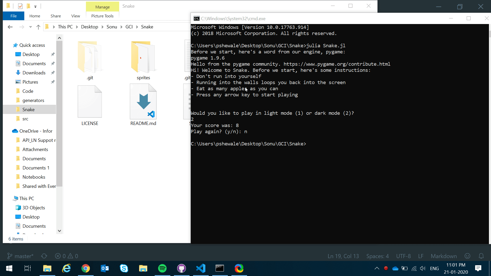

# Snake
 A snake game made in Julia using Pygame

## How to play
- Use arrow keys to move
- Don't run into yourself
- Eat as many apples as you can
- Running into the walls will loop you back into the game

## Requirements
- Needs Python installed (Preferably >3.5)
- Needs pygame installed on Python
- Needs Julia to be configured to run with Python:
    Use PyCall, and set 
        `ENV["PYTHON"] = *path to python*` in Julia REPL

## Demo

## Why?
Why not?